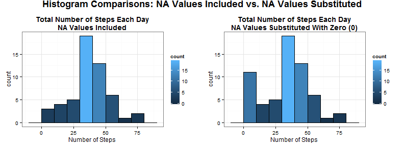

REPRODUCIBLE RESEARCH - PEER ASSESSMENT 1
=========================
***


## Summary

This is the first assignment for the Reproducible Research course in the Data Science 
Specialization, offered by Johns Hopkins Bloomberg School of Public Health. The following is an excerpt from the assignment introduction:

>This assignment makes use of data from a personal activity monitoring device. This device collects data at 5 minute intervals through out the day. The data consists of two months of data from an anonymous individual collected during the months of October and November, 2012 and include the number of steps taken in 5 minute intervals each day.

Exploratory analysis will be performed on the data to see if there are any patterns to discern, and if possible, if there are any stories to be told or if there are questions that can be answered.  Independent of what is found, this is an excercise in reproducible data, and the effectiveness of presenting the reader with enough information to reproduce this analysis.

## Preparation

The data set was downloaded from this [link](https://d396qusza40orc.cloudfront.net/repdata%2Fdata%2Factivity.zip) and was extracted to the following directory:
* ```./data/temp/repdata/``` 

relative to the working directory, with the file named as:
* ```activity.csv```  

The file **PA1_template.Rmd** was created and is located in that directory path. 

The working environment used is: 
* Windows 7, Service Pack 1 (64 bit)
* RStudio, version 0.98.978 (64 bit)
* R version 3.1.1 (64 bit).

## Libraries

4 libraries were added for this assignment, which are the **ggplot2** graphics library, the **grid** library, the **gridExtra** library, and the **xtable** library:


```r
library(ggplot2)
library(grid)
library(gridExtra)
library(xtable)
```

All plots created in this assignment are **ggplot2** plots, consisting of histograms and time series plots.  The **gridExtra** library package allows for grid arrangement of multiple plots created with **ggplot2**, and **grid** is required for **gridExtra**. **xtable** is used to convert tables into HTML format.

NOTE: The R code for constructing the plots and table in this analysis will be excluded during the analysis. Instead, they can be found in the Appendix at the end of this analysis, or in the **PA1_template.Rmd** file.

## Loading the Data

Since the data file is a CSV file, the function ```read.csv()``` was used to read the data into R. Once loaded, the **date** variable was converted to a ```date``` class using ```as.Date```:


```r
theData <- read.csv("activity.csv", sep=",")
theData$date <- as.Date(theData$date)
```

We can see the simple structure of the data frame, as well as the beginning and end of the data set:


```r
str(theData)
```

```
## 'data.frame':	17568 obs. of  3 variables:
##  $ steps   : int  NA NA NA NA NA NA NA NA NA NA ...
##  $ date    : Date, format: "2012-10-01" "2012-10-01" ...
##  $ interval: int  0 5 10 15 20 25 30 35 40 45 ...
```

```r
head(theData)
```

```
##   steps       date interval
## 1    NA 2012-10-01        0
## 2    NA 2012-10-01        5
## 3    NA 2012-10-01       10
## 4    NA 2012-10-01       15
## 5    NA 2012-10-01       20
## 6    NA 2012-10-01       25
```

```r
tail(theData)
```

```
##       steps       date interval
## 17563    NA 2012-11-30     2330
## 17564    NA 2012-11-30     2335
## 17565    NA 2012-11-30     2340
## 17566    NA 2012-11-30     2345
## 17567    NA 2012-11-30     2350
## 17568    NA 2012-11-30     2355
```

Initially, from what we can see, the data records the number of steps every 5 minutes, daily, from 2012-10-01 to 2012-11-30, and there are NA's in the data set.

## Answering the Questions

The following consists of 4 (IV) sections, each with question(s) to answer with exploratory data analysys, creating, using and manipulating data sets from the source data set.

### I. What is the mean total number of steps taken per day?

We create a variable called ```histData``` using the ```tapply()``` function to aggregate the total average steps taken per day, then plot the histogram:


```r
histData <- tapply(theData$steps, theData$date, FUN=mean)
```

 

Next, looking at the summary of the histogram data,


```r
summary(histData)
```

```
##    Min. 1st Qu.  Median    Mean 3rd Qu.    Max.    NA's 
##    0.14   30.70   37.40   37.40   46.20   73.60       8
```

we can see that the Mean and Median values are both **37.4**.

### II. What is the average daily activity pattern?

To try to answer this question, we take the interval and steps variables and aggregate the steps data by its mean:


```r
justInt <- theData[,c(1,3)]
intAgg <- aggregate(.~interval, data=justInt, FUN=mean)
```

This allows us to create a time series plot, using ```intAgg``` as the data set and plot the average steps across all days (```steps```) over the time interval (```interval```). We can see the pattern in this plot:

 

#### II.1. Which 5-minute interval, on average across all the days in the dataset, contains the maximum number of steps?


```r
intAgg[intAgg$steps==max(intAgg$steps),]
```

```
##     interval steps
## 104      835 206.2
```

We can see from this plot that there were not many steps recorded early in the time period, then suddenly many steps were taken, peaking to an average of about **206** steps at the 835^th interval. The average steps decreased until it stays under 100 average steps for awhile, then goes to around zero towards the end of the time interval.

### III. Missing Values

In this section, we will analyze the NA values in the data. We can quickly see the total NA's in each variable:


```r
summary(theData)
```

```
##      steps            date               interval   
##  Min.   :  0.0   Min.   :2012-10-01   Min.   :   0  
##  1st Qu.:  0.0   1st Qu.:2012-10-16   1st Qu.: 589  
##  Median :  0.0   Median :2012-10-31   Median :1178  
##  Mean   : 37.4   Mean   :2012-10-31   Mean   :1178  
##  3rd Qu.: 12.0   3rd Qu.:2012-11-15   3rd Qu.:1766  
##  Max.   :806.0   Max.   :2012-11-30   Max.   :2355  
##  NA's   :2304
```

The summary shows that all NA's are in the ```steps``` variable, and the total is **2304**.

In addition to NA's, we need to analyze the data to see if there are any missing days from aggregation. This tells us that there are NA's in those dates. We also want to make sure there are no dates with some real data mixed with NA's:


```r
## using the date and steps columns to aggregate the average steps 
## for each day. the mean for that day will be substituted for any 
## NA's within the same day, if required.
justDate <- theData[,1:2]
dateAgg <- aggregate(. ~ date, data=justDate, FUN=mean)
  
## check and see what days are missing using dateAgg. We can then 
## list the missing days.
noDate <- theData[!(theData$date %in% dateAgg$date),]
uniqueDate <- unique(noDate$date)
uniqueDate
```

```
## [1] "2012-10-01" "2012-10-08" "2012-11-01" "2012-11-04" "2012-11-09"
## [6] "2012-11-10" "2012-11-14" "2012-11-30"
```

```r
## make sure that the missing days do not have data mixed with NA.  
## If they do not have any data then they are all NA, which is the 
## case after this analysis. Having no row results means there are 
## no matches.
nrow(theData[theData$date %in% uniqueDate & !is.na(theData$steps),])
```

```
## [1] 0
```

Since the result of this analysis shows that the missing dates do not have values mixed with NA's, and since there is no mean or median of the missing dates to use for substitution, we will substitute all NA values with zero (0), into a new data set:


```r
theData2 <- theData
theData2$steps <- sapply(theData2$steps, function(i) ifelse(is.na(i), 0, i))
```

Now that we have a new data set with all the NA values substituted with the value zero (0), we can re-plot the histogram with a new variable ```histData2``` using ```tapply()```, and get the new values for the Mean and Median:


```r
histData2 <- tapply(theData2$steps, theData2$date, FUN=mean)
```

 


```r
summary(histData2)
```

```
##    Min. 1st Qu.  Median    Mean 3rd Qu.    Max. 
##     0.0    23.5    36.1    32.5    44.5    73.6
```

We can see that the **median** value is now **36.1**, and the **mean** value is **32.5**. Now that we have analyzed the NA values and missing dates, we can answer some questions.

#### III.1. Do these values differ from the estimates from the first part of the assignment? 

We can see that the mean and median values had changed after substituting NA values:

<!-- html table generated in R 3.1.1 by xtable 1.7-3 package -->
<!-- Sun Aug 17 14:48:16 2014 -->
<TABLE border=1>
<TR> <TH>  </TH> <TH> Before </TH> <TH> After </TH>  </TR>
  <TR> <TD align="right"> Mean </TD> <TD align="right"> 37.40 </TD> <TD align="right"> 36.10 </TD> </TR>
  <TR> <TD align="right"> Median </TD> <TD align="right"> 37.40 </TD> <TD align="right"> 32.50 </TD> </TR>
   </TABLE>

#### III.2. What is the impact of inputing missing data on the estimates of the total daily number of steps?

With the help of the ```library(gridExtra)``` package, we can now take the two previous histograms and compare them side-by-side. We can see that the first histogram shows a typical single peak plot, whereas the substitution created a two-peak plot:


 

### IV. Are there differences in activity patterns between weekdays and weekends?

To answer this question, we need to create a new factor variable in the data set with 2 levels - **Weekday** and **Weekend**. First, will use the ```weekdays()``` function to create the days that correspond to the date in the data, substitute each day as a weekend or weekday, then convert that variable into a factor. We can then examine the results:


```r
## create the days variable and cbind() to the data set
days <- weekdays(theData2$date)
theData2.1 <- cbind(theData2, days)

## substitute each day with 'weekend' or 'weekday'
theData2.1$days <- sapply(theData2.1$days, function(i) 
    ifelse(i=="Saturday" | i=="Sunday","Weekend", "Weekday"))

## convert the days variable into a factor, and look at the structure
## and summary
theData2.1$days <- as.factor(theData2.1$days)
str(theData2.1)
```

```
## 'data.frame':	17568 obs. of  4 variables:
##  $ steps   : num  0 0 0 0 0 0 0 0 0 0 ...
##  $ date    : Date, format: "2012-10-01" "2012-10-01" ...
##  $ interval: int  0 5 10 15 20 25 30 35 40 45 ...
##  $ days    : Factor w/ 2 levels "Weekday","Weekend": 1 1 1 1 1 1 1 1 1 1 ...
```

```r
summary(theData2.1)
```

```
##      steps            date               interval         days      
##  Min.   :  0.0   Min.   :2012-10-01   Min.   :   0   Weekday:12960  
##  1st Qu.:  0.0   1st Qu.:2012-10-16   1st Qu.: 589   Weekend: 4608  
##  Median :  0.0   Median :2012-10-31   Median :1178                  
##  Mean   : 32.5   Mean   :2012-10-31   Mean   :1178                  
##  3rd Qu.:  0.0   3rd Qu.:2012-11-15   3rd Qu.:1766                  
##  Max.   :806.0   Max.   :2012-11-30   Max.   :2355
```

We can see that in this new data set, there is now a ```days``` variable, as a ```factor``` class of **Weekend** or **Weekday**.

With this new data set, we can create a plot panel of time series plots for both **Weekend** and **Weekday**:

 

The plot shows interesting similarities in the plot shape of ```Weekend``` compared to ```Weekday```.  We can see differences in the size of the shape between the two. This seems to indicate that the subject is performing similar activities during the weekends and the weekdays, except not in the same frequency.  At the start of the time period, there were almost no observations recorded, including the zero (o)values we substituted for NA's.

## Conclusion

There is still much analysis that is needed and more data to get in order to get a better view of the subjects activities; however, from what we see so far, it is safe to conclude that the subject is performing similar activities every day, so it is possible that the activities may not be work related. It is difficult to say at what confidence level, understanding that there is a difference in frequency between ```Weekend``` and ```Weekday```, but the shape is relatively the same. And given that the maximum average of steps was around 200, the subject was most likely not doing something vigorous like walking miles for excercise. 

One could also correlate the small frequency at the beginning and at the end, that these activities may have been temporary only for the months observed. Possibly, the subject had taken on some activities for the purpose of using the monitoring device for this study.  It is hard to say if the subject had done some activities at the beginning and at the end of the time period due to NA's; the device may not have been working at those times or some setting was not initially configured to collect data. Or, perhaps the subject was actually sedentary during these intervals.


***
## Appendix
### Plot Code References
#### The Hist1 Figure (histogram):

```r
## hist1 figure
p1 <-
ggplot(as.data.frame(histData), aes(histData)) + 
    geom_histogram(binwidth=10, color="black", aes(fill= ..count..)) + 
    theme_bw() + xlab("Number of Steps") + 
    ggtitle("Total Number of Steps Each Day\nNA Values Included") + 
    theme(plot.title = element_text(face="bold"))
p1
```

 

#### The TimeSeries1 figure:

```r
## timeseries1 figure
ggplot(intAgg, aes(interval, steps)) + geom_line() + 
    theme_bw() + xlab("Time - 5 min Intervals") + ylab("Average Steps Across All Days") + 
    ggtitle("Average Daily Activity Pattern") + 
    theme(plot.title = element_text(face="bold"))
```

 

#### The Hist2 figure (histogram):

```r
## hist2 figure
p2 <-
ggplot(as.data.frame(histData2), aes(histData2)) + 
    geom_histogram(binwidth=10, color="black", aes(fill= ..count..)) + 
    theme_bw() + xlab("Number of Steps") + 
    ggtitle("Total Number of Steps Each Day\nNA Values Substituted With Zero (0)") + 
    theme(plot.title = element_text(face="bold"))
p2
```

 

#### The Histograms figure (side by side of previous histograms):

```r
## histograms figure
grid.arrange(p1, p2, ncol = 2, 
             main = grid.text("Histogram Comparisons: NA Values Included vs. NA Values Substituted",
             gp=gpar(cex=1.5, fontface="bold")))
```

 

#### The Panels Figure (time series plots):

```r
## panels figure
y <- aggregate(.~ interval + days, data=theData2.1, FUN=mean)

ggplot(y, aes(interval, steps)) + geom_line() + facet_grid(days~.) +
    theme_bw() + xlab("Time - 5 min Intervals") + ylab("Average Steps Across All Days")
```

 

#### The xtable1 Figure:

```r
## xtable1 figure
m <- matrix(c(37.4,37.4,36.1,32.5),nrow=2,ncol=2)
dimnames(m) = list(c("Mean","Median"),c("Before","After"))

xt <- xtable(m)
print(xt, type="html")
```

<!-- html table generated in R 3.1.1 by xtable 1.7-3 package -->
<!-- Sun Aug 17 14:48:22 2014 -->
<TABLE border=1>
<TR> <TH>  </TH> <TH> Before </TH> <TH> After </TH>  </TR>
  <TR> <TD align="right"> Mean </TD> <TD align="right"> 37.40 </TD> <TD align="right"> 36.10 </TD> </TR>
  <TR> <TD align="right"> Median </TD> <TD align="right"> 37.40 </TD> <TD align="right"> 32.50 </TD> </TR>
   </TABLE>
